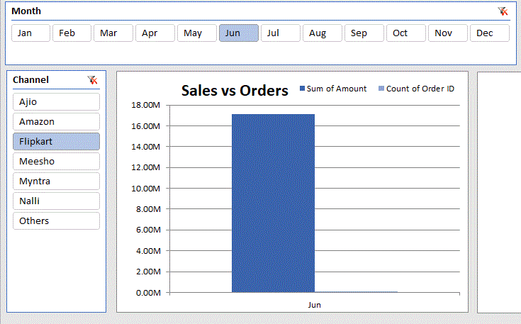
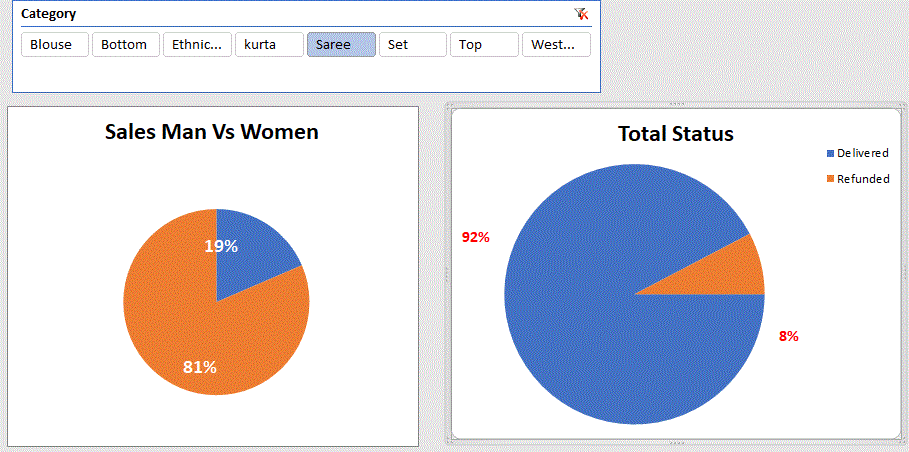
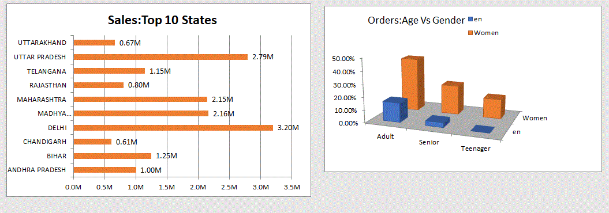
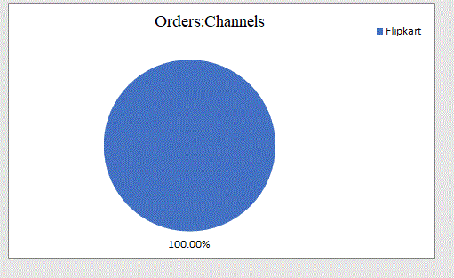

# E-Commerce Sales Analytics Dashboard | Excel

An interactive **Sales Analytics Dashboard** built in Microsoft Excel using 
Pivot Tables, Pivot Charts, and Slicers to analyze e-commerce sales data 
across cities, products, categories, and sales representatives.

##  Dashboard Overview

| Dashboard | Description |
|-----------|-------------|
|  Sales by City | Line chart showing revenue across 10 major cities |
|  Product-wise Sales | Bar chart comparing top-selling products |
|  Sales by Sales Rep | Horizontal bar ranking all sales representatives |
|  Sales by Category | Pie chart: Electronics, Furniture & Stationery |
|  Month-wise Sales | Monthly revenue trend across the full year |

---

## Features

-  Interactive **Month Slicer** to filter all charts dynamically
-  **Pivot Tables** for multi-dimensional data analysis
-  Clean and professional **chart formatting**
-  KPI summary with city, product & rep performance
-  Easy to update with new data
##  Tools Used

- **Microsoft Excel** — Pivot Tables, Pivot Charts, Slicers
- **Data Analysis** — Aggregation, Filtering, Trend Analysis
- **Data Visualization** — Line, Bar, Column & Pie Charts

---

##  Dashboard Preview

##  About Me

**Umair** — Aspiring Data Analyst passionate about turning raw data 
into meaningful business insights using Excel, Pivot Tables & Dashboards.
